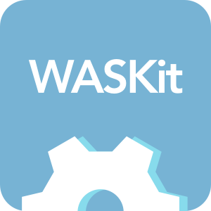

Requirements
=====================
| Swift Version | Minimum iOS  | Minimum Xcode  |
|:--------------------:|:---------------------------:|:----------------------------:|
| 3.0 | iOS 10.0 | Xcode 8+ |

Author
==================
**Wagner Sales**

- **Website:** <a href="http://www.wagnersales.com.br">wagnersales.com.br</a>
- **Email:** <a href="mailto:salesawagner@gmail.com">salesawagner@gmail.com</a>

License
================
MIT license. See the **[LICENSE](https://github.com/salesawagner/waschat/blob/master/LICENSE)** file for more info.